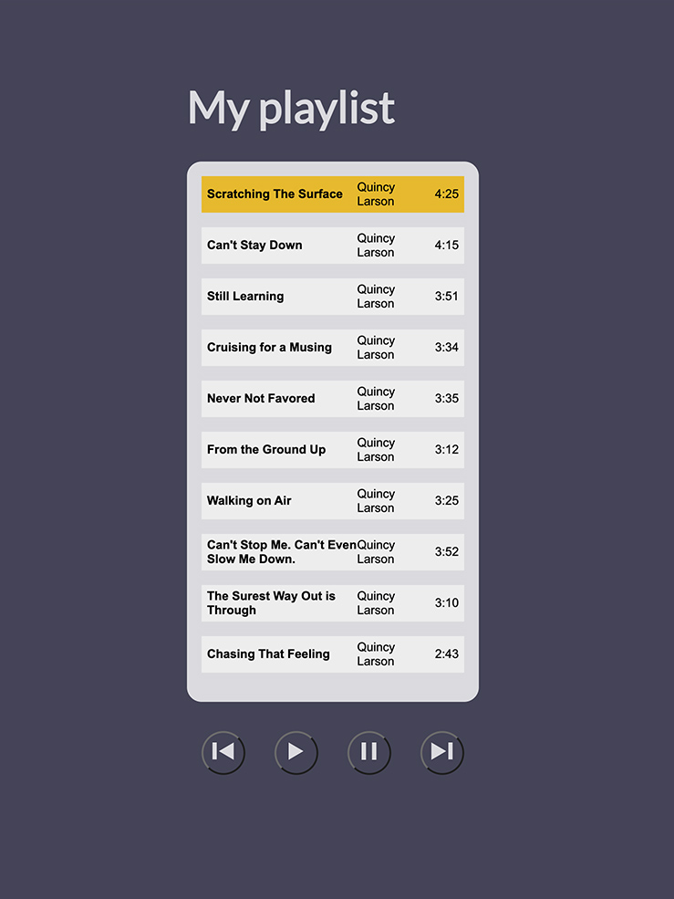

# Music player inspired by Free code camp Music PLayer 
https://www.freecodecamp.org/learn/javascript-algorithms-and-data-structures-v8/#learn-basic-string-and-array-methods-by-building-a-music-player

## Table of contents

- [Overview](#overview)
  - [The challenge](#the-challenge)
  - [Screenshot](#screenshot)
  - [Links](#links)
- [My process](#my-process)
  - [Built with](#built-with)

- [Author](#author)

## Overview

### The challenge

- Build a simple music player with provided tracks

### Screenshot

### Links

- Solution URL: https://github.com/ortalyarts/freecodecamp-my-music-player
- Live Site URL: https://freecodecamp-my-music-player.vercel.app/

## My process

### Built with

- Semantic HTML5 markup
- CSS custom properties
- Flexbox
- CSS Grid
- Vanilla JS

## Author

- OrtalyARTS
- Inspired by Free code camp Music PLayer 
https://www.freecodecamp.org/learn/javascript-algorithms-and-data-structures-v8/#learn-basic-string-and-array-methods-by-building-a-music-player